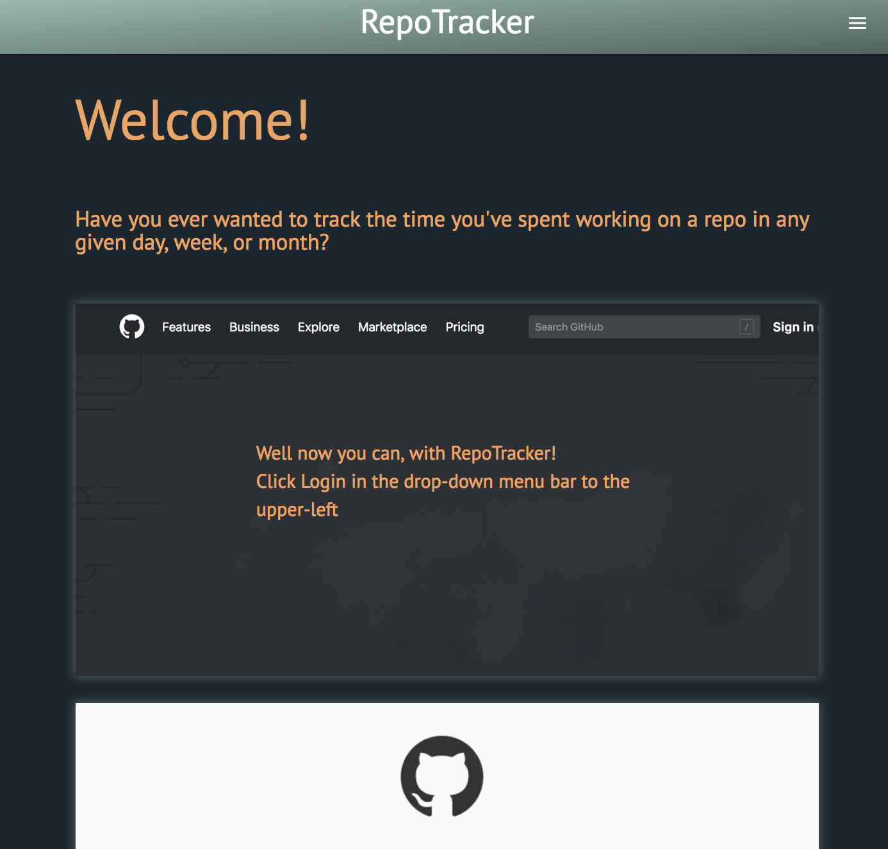
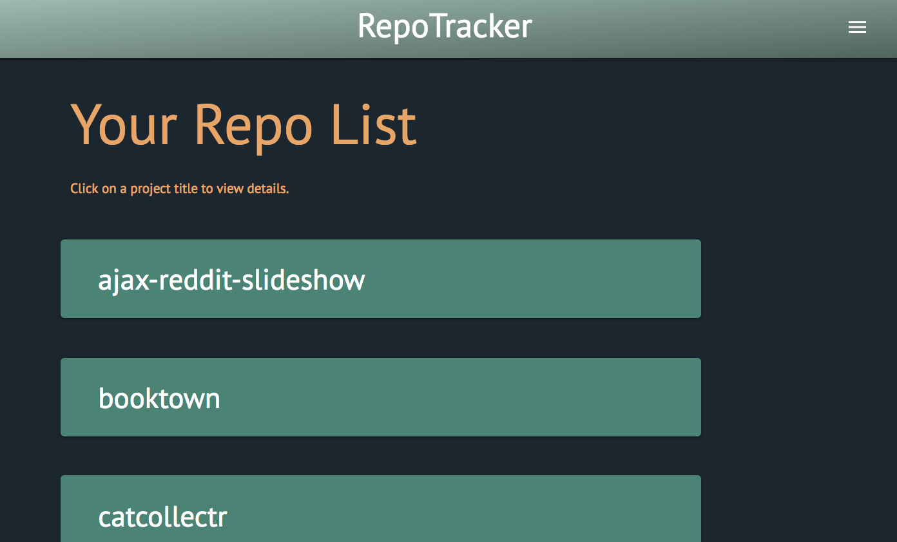
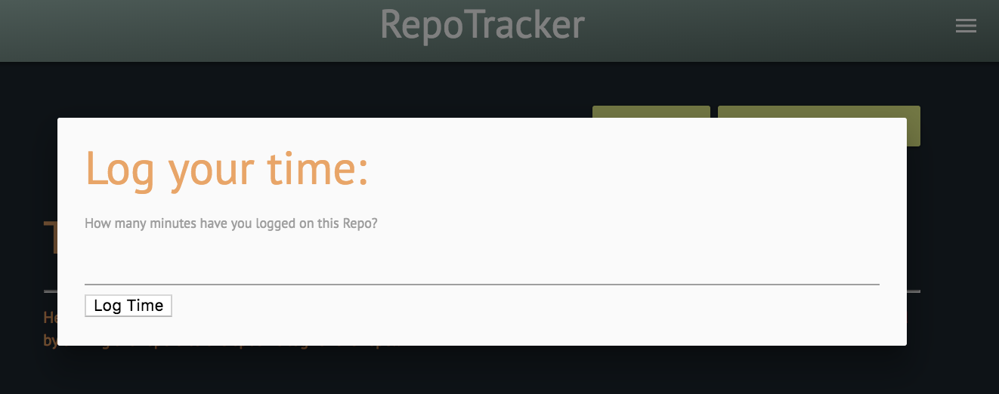
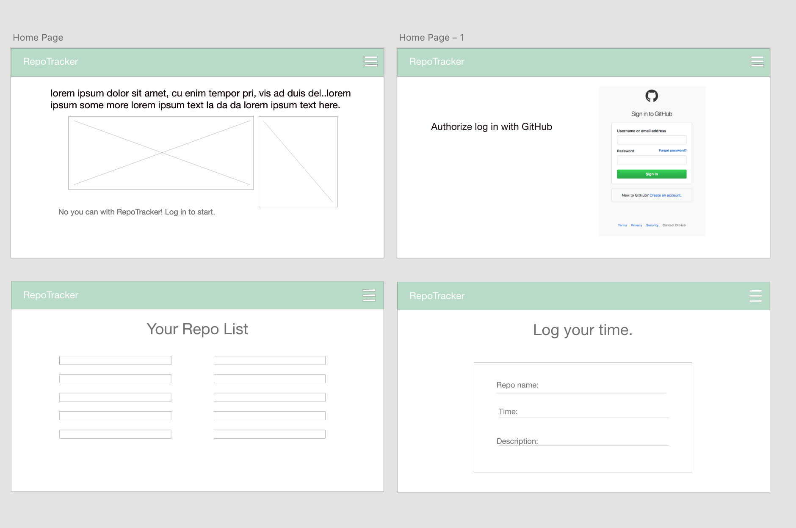

[Live Site](heroku link)

#### WDI Seattle Project 4
### Developers:
#### Matt Carver - Frontend & Backend Web Developer
#### Eva Barrett - Frontend & Backend Web Developer

## About App
Log your GitHub repos and save the total time on the RepoTracker App.

How to use the app:
1. Click Login in drop down bar at the top right on the home page.
2. Authorize your log in credentials with GitHub.
3. Your list of repos will be generated.
4. Click on a single repo then click 'log time' for the modal to appear.
5. Within the modal, log your time for that specific repo.
6. Click submit and below will be your updated logged time for each repo.
7. Click Logout to end your session.

#

#

#

#

Planning Process:

## Wire Frames
#### Created in Adobe XD

User Stories:
- Megan is improving her Web Development skills and wants to log the amount of time she spends on her projects. She uses RepoTracker to see her total time spent on each repository.

- Rob is applying for Web Development jobs and wants to track the time spend on each repository. He uses GitHub which is a great way to track his daily commits and with RepoTracker he can show his potential employers how much time he spent on each individual repos.

## Planning Process

- brainstormed ideas
- researched API's
- discussed ideas
- Trello board planning
- wrote pseudo code to plan out difficult parts of the app
- drew wire frames with AdobeXd for layouts
- listed routes needed for app
- listed needed models
- drew out db models to visualize how they connect

##### Testing/Debugging:
- GitHub API you can only get users by their username not their GitHub id.

## Routes

## auth routes
| Method | Path						|
| -------| ---------------|
| GET 	 | /auth				  |
| GET    | /auth/logout   |
| GET 	 | /auth/github		|

## repos routes
| Method | Path						|
| -------| ---------------|
| GET 	 | /repos/				|
| GET 	 | /repos/:id			|
| POST   | /repos/:id			|

## time routes
| Method | Path						|
| -------| ---------------|
| POST 	 | /time/:id			|

##### Key Technologies Used:
- Node
- Express
- EJS
- Postgres
- JS
- Materialize

## Future Goals
- Tracking daily, weekly, monthly logged time
- View total time spend on all repositories
- Description of each repos (user inputs details)
